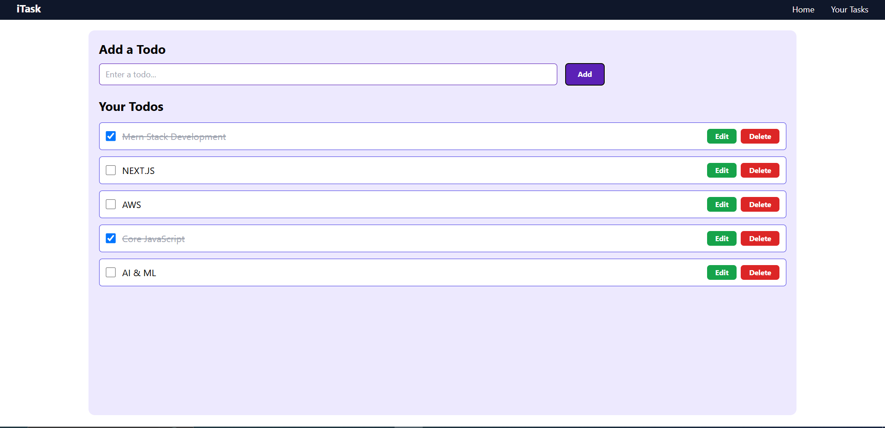

```markdown
# ✅ Todo Manager

A minimal and responsive Todo App built with **React** and **Tailwind CSS**. It supports creating, editing, and deleting tasks and stores your list in **LocalStorage**.

## 🌐 Live Demo

🔗 [Live Site](https://rahulpanchta.vercel.app)

## 🛠️ Tech Stack

- React (Hooks)
- Tailwind CSS
- LocalStorage (for persistence)
- Framer Motion (optional for animations)

## ✨ Features

- ➕ Add, edit, and delete todos
- ✅ Mark as complete/incomplete
- 💾 Persistent storage via browser LocalStorage
- 🌓 Light/dark mode toggle (optional)
- 📱 Fully responsive design

```
## 🖼️ Screenshots



## 🚀 Getting Started

### Clone & Run

```bash
git clone https://github.com/ErRahulPanchta/portfolio.git
cd portfolio
npm install
npm run dev
```
Project Structure
```arduino
portfolio/
├── src/
│   ├── App.jsx
│   ├── components/
│   └── pages/
├── public/
└── .env
```
📦 Deploy
You can deploy this to Vercel, Netlify, or any static host that supports React/Vite.

✍️ Author
Rahul Panchta

💡 Suggestions and stars are welcome!

```yaml
Let me know if you’d like combined portfolio-level documentation or contribution guidelines next!
